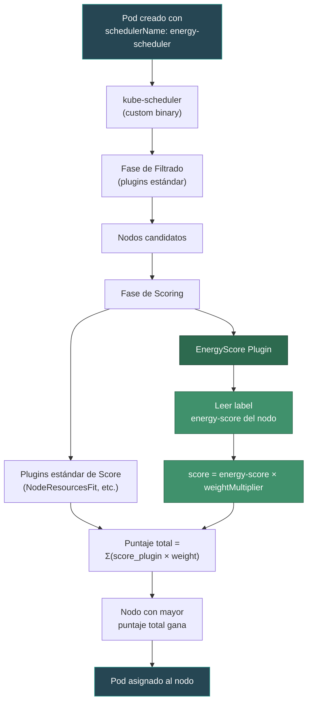
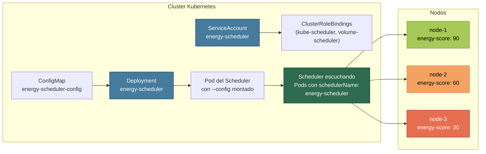

# EnergyScore Scheduler Plugin

## Descripción General

**EnergyScore** es un plugin de scheduling para Kubernetes que incorpora criterios de eficiencia energética en la decisión de colocación de Pods. Funciona como un **ScorePlugin** dentro del framework del kube-scheduler, sumando un puntaje adicional basado en la etiqueta `energy-score` de cada nodo. De esta forma, los nodos más eficientes energéticamente reciben una mayor preferencia al momento de asignar cargas de trabajo.

El plugin **no reemplaza** la lógica de scoring del scheduler estándar de Kubernetes, sino que **se suma** a ella. El puntaje de energía se agrega al puntaje total que ya calculan los demás plugins (balanceo de recursos, afinidad, etc.), otorgando una ligera preferencia a los nodos más eficientes.

---

## Arquitectura y Flujo de Funcionamiento



---

## Componentes del Plugin

### 1. Struct `EnergyScore`

```go
type EnergyScore struct {
    handle           fwk.Handle
    weightMultiplier float64
}
```

| Campo              | Tipo      | Descripción                                                                 |
|--------------------|-----------|-----------------------------------------------------------------------------|
| `handle`           | `fwk.Handle` | Handle del framework del scheduler, permite acceder al snapshot de nodos. |
| `weightMultiplier` | `float64`    | Multiplicador que escala el puntaje de energía para controlar su impacto. |

### 2. Método `Score`

Es el corazón del plugin. Se ejecuta **una vez por cada nodo candidato** durante la fase de scoring:

```go
func (es *EnergyScore) Score(ctx, state, pod, nodeName) (int64, *Status) {
    // 1. Obtiene la info del nodo desde el snapshot
    nodeInfo := es.handle.SnapshotSharedLister().NodeInfos().Get(nodeName)

    // 2. Busca el label "energy-score" en el nodo
    val := nodeInfo.Node().Labels["energy-score"]

    // 3. Calcula: score = valor_label × weightMultiplier
    score = int64(parsed * es.weightMultiplier)

    return score
}
```

**Lógica paso a paso:**

1. Obtiene la información del nodo del snapshot compartido del scheduler.
2. Busca el label `energy-score` en el nodo.
3. Si el label existe, parsea su valor numérico y lo multiplica por `weightMultiplier`.
4. Si el label no existe, retorna `0` (sin impacto en el score).

### 3. Constructor `New`

Recibe los argumentos de configuración (`EnergyScoreArgs`) y crea la instancia del plugin:

```go
func New(ctx, obj, handle) (Plugin, error) {
    args := obj.(*config.EnergyScoreArgs)
    return &EnergyScore{
        handle:           handle,
        weightMultiplier: args.WeightMultiplier,
    }, nil
}
```

---

## Configuración

### Argumentos del Plugin (`EnergyScoreArgs`)

Definidos en `apis/config/types.go`:

```go
type EnergyScoreArgs struct {
    metav1.TypeMeta
    WeightMultiplier float64 `json:"weightMultiplier,omitempty"`
}
```

| Parámetro          | Tipo      | Descripción                                                                                      |
|--------------------|-----------|--------------------------------------------------------------------------------------------------|
| `WeightMultiplier` | `float64` | Factor multiplicador del puntaje de energía. Valores < 1.0 reducen el impacto; > 1.0 lo amplifican. |

### Archivo de Configuración del Scheduler (`energy-score-config.yaml`)

```yaml
apiVersion: kubescheduler.config.k8s.io/v1
kind: KubeSchedulerConfiguration
leaderElection:
  leaderElect: false
profiles:
  - schedulerName: energy-scheduler
    plugins:
      score:
        enabled:
          - name: EnergyScore
            weight: 2           # Peso del plugin dentro del scoring total
    pluginConfig:
      - name: EnergyScore
        args:
          weightMultiplier: 1.0  # Multiplicador interno del puntaje
```

> **Nota:** Existen **dos niveles de control** sobre el impacto del puntaje:
> - `weight: 2` — Peso del plugin en la suma ponderada del scheduler (comparable con otros plugins).
> - `weightMultiplier: 1.0` — Multiplicador interno que escala el valor del label antes de reportarlo.

---

## Cálculo del Puntaje — Ejemplo

Supongamos 3 nodos con los siguientes labels y `weightMultiplier: 0.5`:

| Nodo    | Label `energy-score` | Cálculo                   | Score del Plugin | Score Estándar | Score Total (weight=2) |
|---------|----------------------|---------------------------|------------------|----------------|------------------------|
| node-A  | `90`                 | `int64(90 × 0.5) = 45`   | 45               | 60             | 60 + (45 × 2) = **150** |
| node-B  | `70`                 | `int64(70 × 0.5) = 35`   | 35               | 80             | 80 + (35 × 2) = **150** |
| node-C  | `40`                 | `int64(40 × 0.5) = 20`   | 20               | 85             | 85 + (20 × 2) = **125** |

En este ejemplo, node-A y node-B empatan gracias al boost energético. Sin el plugin, node-C habría ganado solo por recursos disponibles.

---

## Flujo de Despliegue



### Pasos para desplegar:

1. **Etiquetar los nodos** con su puntaje energético:
   ```bash
   kubectl label nodes node-1 energy-score=90
   kubectl label nodes node-2 energy-score=60
   kubectl label nodes node-3 energy-score=30
   ```

2. **Crear RBAC** (ServiceAccount + ClusterRoleBindings):
   ```bash
   kubectl apply -f manifests/energy-scheduler/rbac.yaml
   ```

3. **Crear ConfigMap** con la configuración del scheduler:
   ```bash
   kubectl create configmap energy-scheduler-config \
     --from-file=energy-score-config.yaml \
     -n kube-system
   ```

4. **Desplegar el scheduler**:
   ```bash
   kubectl apply -f manifests/energy-scheduler/deployment.yaml
   ```

5. **Crear Pods** que usen el scheduler personalizado:
   ```yaml
   apiVersion: v1
   kind: Pod
   metadata:
     name: test-energy-score
   spec:
     schedulerName: energy-scheduler   # <-- Apunta al scheduler custom
     containers:
     - name: pause
       image: k8s.gcr.io/pause:3.2
   ```

---

## Registro del Plugin

El plugin se registra en el binario del scheduler en `cmd/scheduler/main.go`:

```go
command := app.NewSchedulerCommand(
    // ... otros plugins ...
    app.WithPlugin(energyscore.Name, energyscore.New),
)
```

Y sus tipos se registran en el esquema interno en `apis/config/register.go`:

```go
func addKnownTypes(scheme *runtime.Scheme) error {
    scheme.AddKnownTypes(SchemeGroupVersion,
        // ... otros tipos ...
        &EnergyScoreArgs{},
    )
}
```

---

## Resumen

| Aspecto                  | Detalle                                                        |
|--------------------------|----------------------------------------------------------------|
| **Tipo de Plugin**       | `ScorePlugin`                                                  |
| **Interfaz**             | `fwk.ScorePlugin`                                              |
| **Fuente de Datos**      | Label `energy-score` en los nodos                               |
| **Parámetro Configurable** | `weightMultiplier` (escala el impacto del puntaje)           |
| **Impacto en Scheduling** | Suma un bonus al score total, favoreciendo nodos eficientes   |
| **Scheduler Name**       | `energy-scheduler`                                             |
| **Namespace**            | `kube-system`                                                  |
